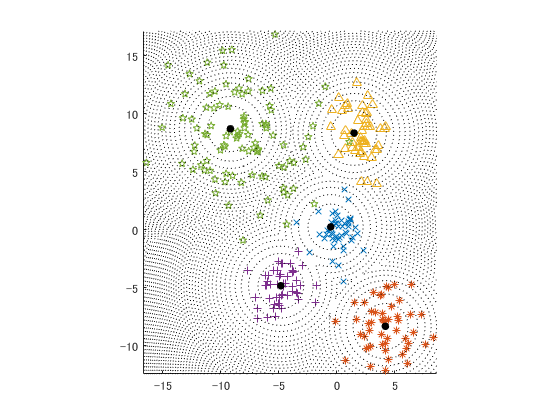
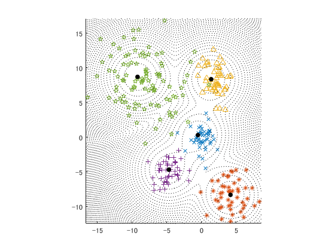
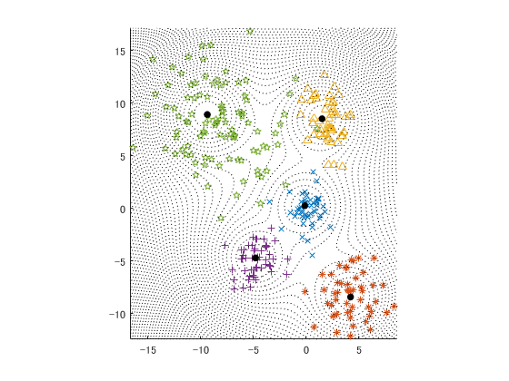
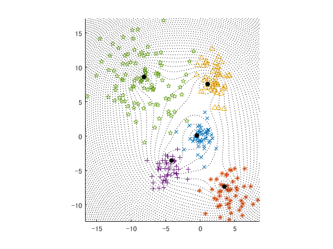
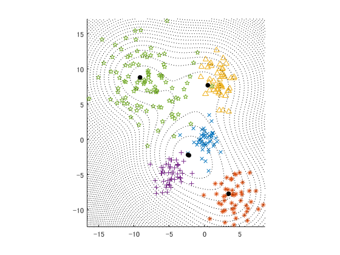
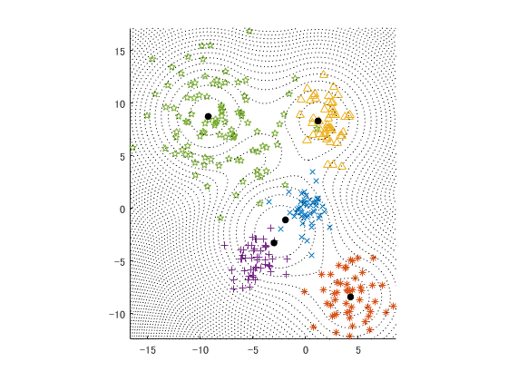

# C-Means

This is an implementation of fuzzy c-means (a.k.a k-means) based on [this paper](cmeans_dca.pdf) (in Japanese). 
<code>c_means.m</code> is a generic fuzzy c-means source code. 
By inputting a fuzzy max function and its gradient function, a specific fuzzy c-means algorithm is performed.
The way of usage may be found in <code>plot_clustering.m</code>, which shows the result of <code>c_means.m</code> for <code>data/norm5.mat</code> data set.

## Execution

In `plot_clustering.m`, set

    max_func.val = @max_val;
    max_func.grad = @max_grad;
    
and run

    >> plot_clustering
    
then, we get the result of c-means as follows.

If you want to do the fuzzy c-means with the entropy regularization, set

    nu = 10
    max_func.val = @(X) entro_val(X,nu);
    max_func.grad = @(X) entro_grad(X,nu);
    
ane run

    >> plot_clustering
    
then, we get the result of c-means as follows.

## Samples

### Bezdek's fuzzy c-means for parameter 2 and 20

### Fuzzy c-means with the entropy regularization for parameter 10 and 30

### Fuzzy c-means with the quadratic regularization for parameter 20 and 60

